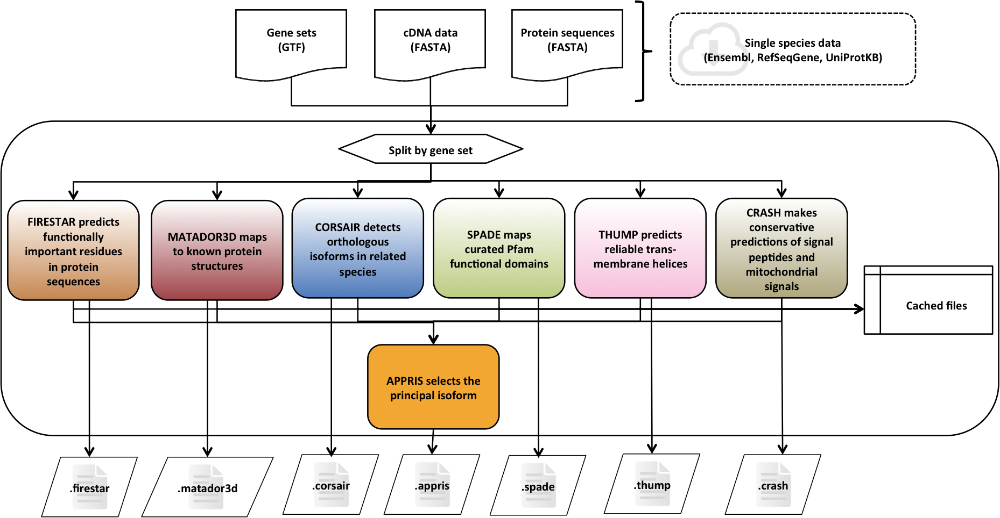

Welcome to APPRIS - A system for annotating alternative splice isoforms
=======================================================================
[APPRIS](https://appris.bioinfo.cnio.es/) [1,2] is a system that deploys a range of computational methods to provide value to the annotations of the human genome. APPRIS also selects one of the CDS for each gene as the principal isoform.

APPRIS defines the principal variant by combining protein structural and functional information and information from the conservation of related species.

The server has been used in the context of the scale up of the [GENCODE](https://www.gencodegenes.org/), a sub-project of the ENCODE project to annotate the Human genome but APPRIS is being used for other species:
  * Vertebrate genomes:
	  * Human
	  * Mouse
	  * Zebrafish
	  * Rat
	  * Pig
	  * Chimpanzee
  * Invertebrate genomes:
  	  * Fruitfly
  	  * C. elegans

System overview
===============
The goals of the APPRIS system are to annotate alternative variants with reliable biological data and to select the primary variant for each gene. APPRIS is based on a range of complementary computational methods.

The methods in APPRIS are the following:
  * Functionally important residues, firestar
  * Protein structural information, Matador3D
  * Presence of whole protein domains, SPADE
  * Conservation against vertebrates, CORSAIR
  * Presence of whole trans-membrane helices, THUMP
  * Prediction of signal peptide and sub-cellular location, CRASH
  * Selective pressure evolution of exons, INERTIA [Note: Currently, this method is not affecting in the selection of the principal isoform]

Installation
============
For this section, read the [INSTALL readme file](docs/INSTALL.md).

Data access
===========
The APPRIS websites offer an export option, suitable for small amounts of data. This is the ideal option if you want a protein sequence as a FASTA file, or a JSON/GTF file of a few features of a gene or transcript. Furthermore, you can get annotation tracks of gene/transcripts in the BED format. Simply click on one of the "Export" links in the right menu, and select the output options. If you wish to extract multiple features, we recommend the following alternatives.

  * Downloads, APPRIS data text files.
  https://appris.bioinfo.cnio.es/#/downloads

  * Web Services, APPRIS data can be returned remotely using web services.
  https://apprisws.bioinfo.cnio.es/

References
==========
If you find APPRIS useful, please consider citing our latest publication:

[1] APPRIS WebServer and WebServices.
Rodriguez JM, Carro A, Valencia A, and Tress ML.
Nucleic Acids Res. 2015 May 18.
PUBMED:25990727 DOI:10.1093/nar/gkv512

[2] APPRIS: annotation of principal and alternative splice isoforms.
Rodriguez JM, Maietta P, Ezkurdia I, Pietrelli A, Wesselink JJ, Lopez G, Valencia A and Tress ML.
Nucleic acids research 2013;41;Database issue;D110-7
PUBMED:23161672 DOI:10.1093/nar/gks1058

Contact
=======
This APPRIS website is powered by the Structural Computational Biology Group at
	Centro Nacional de Investigaciones Oncologicas, ([CNIO](https://www.cnio.es/))
		and
	Instituto Nacional de Bioinformatica, ([INB](https://inb-elixir.es/))

If you have questions or comments, please write to:
    APPRIS mail, appris.cnio@gmail.com
	Michael Tress, mtress@cnio.es
